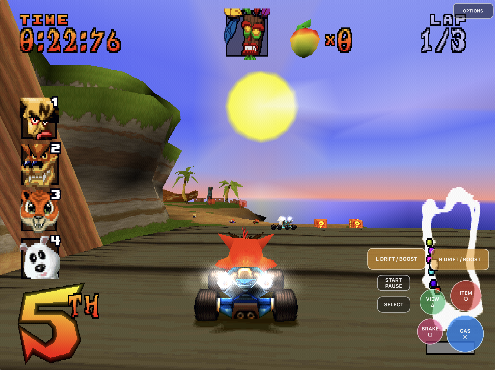
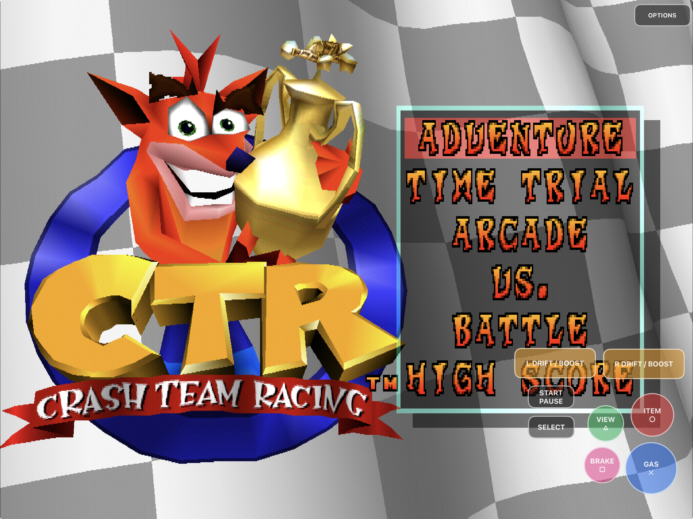
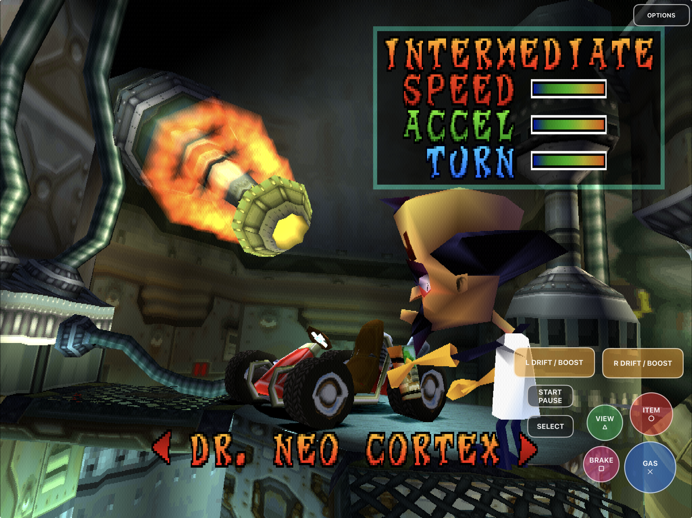
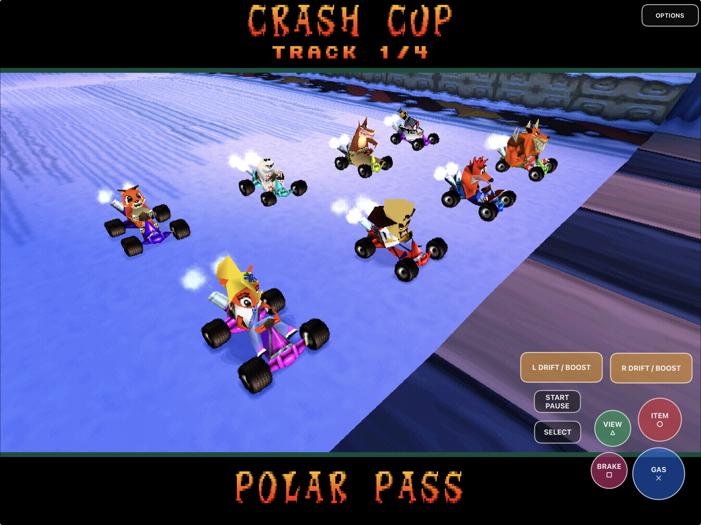
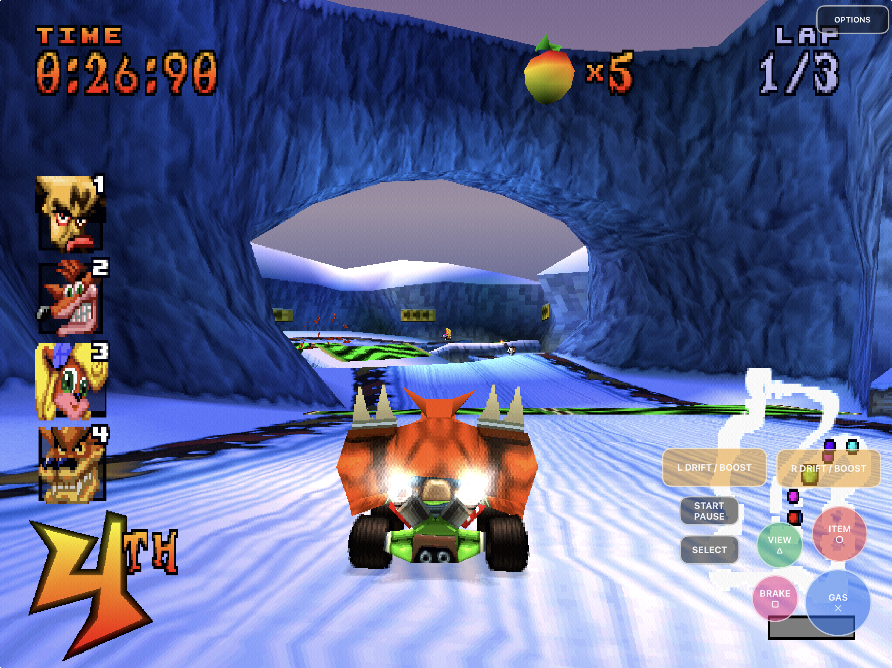
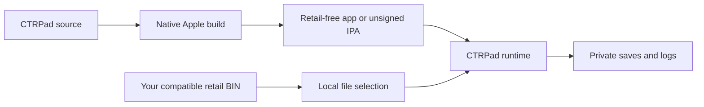

# CTRPad

<p align="center">
  
</p>

<p align="center">
  <strong>Crash Team Racing, rebuilt as a native app for Apple Silicon Mac, iPhone, and iPad.</strong><br>
  Native ARM64 rendering, touch controls, controller support, Files-based setup,
  and 1×–4× internal resolution.
</p>

<p align="center">
  <a href="https://github.com/chrissotraidis/ctrpad/actions/workflows/apple-packages.yml"></a>
  
  
  
  
</p>



CTRPad is an unofficial native Apple-platform port built from
[CTR Native](https://github.com/CTR-tools/ctr-native) and the
[CTR-ModSDK](https://github.com/CTR-tools/CTR-ModSDK) decompilation project.
It runs the decompiled game code directly; it is not an emulator and does not
need a PlayStation BIOS.

To our knowledge, this is the first documented native iPhone and iPad port
built from the CTR-ModSDK/CTR Native codebase. That is an Apple-platform claim,
not a claim that CTRPad created the first native CTR port: CTR Native established
the Windows and Linux port on which this work is based.

This repository contains source, Apple integration, documentation, and
retail-free build tooling. It does **not** contain Crash Team Racing, a disc
image, extracted retail assets, saves, Apple signing credentials, or other
playable game data. You must provide your own legally acquired compatible
NTSC-U retail disc image. Read the
[rights and licensing boundary](RIGHTS_AND_LICENSES.md) before redistributing
the project or a build.

## Highlights

- Native ARM64 application bundles for Apple Silicon macOS, iPhone, and iPad.
- Native OpenGL on macOS and GLES 3 through SDL/UIKit on iOS and iPadOS.
- Files-based disc selection with validation and non-destructive replacement.
- Touch-anywhere analog steering, editable controls, Gas lock, handedness,
  size, and 10%–100% opacity controls.
- 1×, 2×, 3×, and 4× internal geometry resolution on iPhone and iPad.
- SDL game-controller, keyboard, and desktop mouse-button input paths.
- Private memory-card saves, rotating logs, and update installs that preserve
  the application data container.
- A committed engineering journal and parity ledger explaining how the port
  was built, including failed and rejected approaches.

## Install status

| Target | Current status | Best path today |
|---|---|---|
| Apple Silicon Mac | **Source build available** | Build `CTRPad.app` locally using the commands below. No public macOS ZIP has been published yet. |
| iPhone and iPad | **Source build and local signing available** | Build one universal iPhone/iPad app, produce an unsigned IPA, and sign it with your own Apple ID. No downloadable IPA has been published yet. |
| iOS Simulator | **Available for development** | Build the Simulator preset and use the guarded installer. Simulator is not physical-device proof. |
| Windows and Linux | **Supported by the native codebase** | Use the desktop scripts or CMake presets. Apple platforms are CTRPad's primary focus. |
| App Store / TestFlight | **Not announced** | No official listing, public TestFlight, or paid build exists. |

Current development builds have been signed, installed, launched, and played
on an iPad Pro and iPhone 14. The screenshots below are iPad captures. Physical
controller compatibility still depends on the controller model and operating
system, and the full controller hardware matrix remains open.

## Get started

Every target requires your own NTSC-U, single-track raw MODE2/2352 Crash Team
Racing BIN. A cooked 2048-byte ISO is not a substitute because it omits the
raw XA/STR sector data used for music, speech, and video.

### Requirements

- a clone of this repository;
- CMake 3.20 or newer;
- Ninja for the Apple presets;
- Xcode and its command-line tools for Apple builds; and
- your own compatible NTSC-U retail disc image.

On macOS, install the build tools with Homebrew:

```sh
brew install cmake ninja
git clone https://github.com/chrissotraidis/ctrpad.git
cd ctrpad
```

### Apple Silicon Mac

```sh
cmake --preset macos-arm64-app
cmake --build --preset macos-arm64-app
ctest --preset macos-arm64-app
open build-macos-arm64-app/CTRPad.app
```

CTRPad opens a native file picker on first launch. Choose your BIN once; the
app validates it, remembers its external location, and keeps saves and logs in
Application Support. For packaged builds, Gatekeeper behavior, disc changes,
and optional Developer ID notarization, read
[Install CTRPad on macOS](docs/INSTALL-MACOS.md).

### iPhone or iPad

The same device build supports both iPhone and iPad:

```sh
cmake --preset ios-device-arm64
cmake --build --preset ios-device-arm64
./package-ios.sh
```

The resulting IPA under `dist/` is deliberately unsigned. It contains no
maintainer certificate, provisioning profile, game data, or save data. Sign it
with your own Apple ID using a compatible sideloading tool, or supply your own
Apple development identity and profile to `package-ios.sh` for direct device
installation.

The complete signing commands, profile requirements, AltStore Classic path,
in-place update procedure, and device-verification workflow are in
[Build, sign, and sideload CTRPad](docs/INSTALL-IOS.md). Deleting the app also
deletes its private imported disc and saves unless your sideloading tool backs
them up; update-install instead whenever possible.

### iPhone or iPad Simulator

```sh
cmake --preset ios-simulator-arm64
cmake --build --preset ios-simulator-arm64

./tools/install-ios-simulator.sh \
  --device YOUR_BOOTED_SIMULATOR_UDID \
  --launch
```

Boot exactly one iPhone or iPad Simulator before running the installer. The
helper signs an isolated Simulator copy and verifies that the installed
executable matches the product just built.

### Windows and Linux

Windows MSVC and MinGW scripts plus the Linux build remain available for the
desktop native port. See [Desktop builds](#desktop-builds) below.

## First launch on Apple platforms

CTRPad never downloads or bundles game data.

On iPhone or iPad:

1. Launch CTRPad and select **Choose CTR disc image**.
2. Pick your own compatible raw NTSC-U BIN through Files.
3. Wait while CTRPad stages, validates, and imports the image.
4. The game starts in the same app process after a valid import.

The imported image is stored privately under
`Documents/CTRPad/assets/ctr-u.bin`. Invalid or cancelled replacements preserve
the previous verified import. Open **Options → Change disc…** to select another
image.

On macOS, launch `CTRPad.app` and choose the BIN in the native first-launch
panel. The app remembers the external file path without copying game data into
the bundle. Run `CTRPad --choose-disc` when you deliberately want to select a
different image.

## Native resolution and Options

Open **Options** during play on iPhone or iPad to select 1×, 2×, 3×, or 4×
internal resolution. Higher values render game geometry at a larger internal
framebuffer size, which improves polygon edges while retaining the original
PS1 textures and logical VRAM effects. Higher scales use more GPU power; 1× is
the compatibility baseline.

Options also contains:

- on-screen control visibility;
- left- or right-side steering;
- global control size;
- a continuous 10%–100% opacity slider;
- the touch-layout editor and reset action; and
- safe disc reselection.

CTRPad preserves the original 4:3 presentation. It does not stretch the image
to fill a widescreen display.

## Touch controls

CTRPad provides separate safe-area-aware landscape defaults for iPhone and
iPad. Touch anywhere in the lower steering-side half to place the analog stick
under your thumb. The stick follows the touch and disappears on release, so
you never need to find a fixed control before steering.

| Touch control | PlayStation input | Typical use |
|---|---|---|
| Steer | Left analog stick | Continuous steering |
| Stick outer ring | D-pad | Menus and digital direction input |
| **Gas ✕** | Cross | Accelerate and confirm |
| **Brake □** | Square | Brake, reverse, and menu action |
| **Item ○** | Circle | Use item and menu action |
| **View △** | Triangle | Camera, skip, and menu action |
| **L Drift / Boost** | L1 | Hop, drift, and boost |
| **R Drift / Boost** | R1 | Alternate hop and drift side |
| **Start / Pause** | Start | Start, advance, pause, or resume |
| **Select** | Select | Retail Select input |

On iPhone, the shoulder controls are labeled **Drift Hold** (R1) and
**Boost Tap** (L1) to teach the power-slide technique: hold R1 to maintain the
slide, then tap L1 when the meter is red. The original game reads the held and
tapped shoulders separately, so both inputs remain available.

### Customize the layout

1. Open **Options**.
2. Choose **Edit touch layout**.
3. Drag any gameplay control to reposition it.
4. Select a control and use **−** or **+** to resize it from 70% to 150%.
5. Choose **Done**, or **Reset** to restore the device and steering-side
   defaults.

Phone/tablet and left/right-steering profiles persist independently. Options
remains reachable when the gameplay overlay is hidden.

### Gas lock

Hold **Gas ✕** for two seconds to lock acceleration. CTRPad confirms the lock
with visual and haptic feedback. Tap Gas once to release it. All held inputs
are released when controls are hidden or rebuilt, the editor opens, gameplay
ends, or the app moves to the background.

## Controllers and local multiplayer

CTRPad includes SDL's native game-controller path with both sticks, D-pad,
face buttons, L1/L2/R1/R2, Start, Select/Back, hot-plug handling, and rumble
when the controller and operating system support it. Touch can remain enabled
beside a controller or be hidden from Options.

The software input path and virtual-controller integration tests cover
standardized buttons, axes, slot ownership, hot-plug, and rumble. A particular
Bluetooth, USB, MFi, Xbox, PlayStation, or Nintendo controller still requires
model-specific physical testing.

**Local multiplayer is not currently advertised as complete.** Desktop input
supports four controller slots and a PlayStation multitap-shaped bus, but the
current split-screen, battle, and multiplayer end-state paths have not had a
complete acceptance run. On iPhone and iPad, touch, keyboard, and connected
gamepads intentionally compose into player one instead of creating additional
players.

## Current screenshots

<table>
  <tr>
    <td width="50%"></td>
    <td width="50%"></td>
  </tr>
  <tr>
    <td align="center"><strong>Native startup</strong><br>The complete retail presentation runs inside the iPad app.</td>
    <td align="center"><strong>Menus and characters</strong><br>Models, textures, audio, UI, and touch input stay in one process.</td>
  </tr>
  <tr>
    <td width="50%"></td>
    <td width="50%"></td>
  </tr>
  <tr>
    <td align="center"><strong>Full race presentation</strong><br>Karts, effects, track scenes, and the editable overlay render together.</td>
    <td align="center"><strong>Touch-first play</strong><br>Analog steering and every required PlayStation control remain reachable.</td>
  </tr>
</table>

All five README captures were supplied from an iPad running CTRPad with a
locally provided retail image. The disc image, extracted assets, and saves used
for these captures are not part of this repository or its packages.

## What works

| Area | Current result |
|---|---|
| Native game | CTR Native/CTR-ModSDK game source runs through CTRPad's host platform layer |
| Apple targets | Thin ARM64 macOS, iPhone, iPad, and Simulator products build |
| Rendering | Native macOS OpenGL and shared GLES 3 Apple-mobile presentation |
| Game setup | macOS file picker and iOS/iPadOS Files import with disc validation |
| Resolution | 1×–4× internal geometry resolution on iPhone and iPad |
| Touch | Dynamic analog steering, complete controls, layout editing, opacity, handedness, and Gas lock |
| Controllers | SDL controller mapping, axes, hot-plug, slot ownership, and rumble path |
| Saves | Private memory cards, atomic replacement, and non-destructive app updates |
| Lifecycle | Rotation, resizing, background/foreground, and held-input cleanup |
| Audio | Native mixing, XA/music/voice playback, and UIKit tracking-safe frame scheduling |
| Packaging | Retail-data exclusion, exact source identity, macOS ZIP support, and unsigned or user-signed IPA output |
| Local multiplayer | Original game paths and desktop controller slots are present; complete physical acceptance remains open |

Detailed evidence and remaining hardware gates live under
[the parity ledger](docs/parity/README.md).

## How the Apple port was built

CTRPad's Apple work was not a wrapper around an emulator. The project converted
the inherited 32-bit host assumptions for LP64/ARM64, kept PlayStation-shaped
serialized data separate from native pointers, brought the renderer to shared
OpenGL/GLES semantics, added Apple storage and lifecycle boundaries, and then
built touch, signing, packaging, and device-verification layers around the
native game.

The initial Apple campaign ran from July 29 through August 2, 2026. The
repository intentionally retains the complete technical record:

- [Build-history overview](docs/history/README.md) — the readable phase map.
- [Three-day timeline](docs/history/THREE-DAY-TIMELINE.md) — chronological
  milestones and publication boundaries.
- [Engineering journal](docs/history/ENGINEERING-JOURNAL.md) — commands,
  debugger evidence, hashes, failures, corrections, and rejected routes.
- [Architecture records](docs/architecture/) — the LP64 conversion and durable
  design decisions.
- [Parity reports](docs/parity/README.md) — focused, timestamped validation
  results and their explicit limits.

The port was developed with AI-assisted engineering through Codex under
maintainer direction. The committed journal is the auditable record: failed
experiments are preserved, and build, Simulator, installed process, and
physical play evidence are not treated as interchangeable.

## Retail-free and reproducible

The build never reads or packages your retail disc. Game data enters only on
first launch through Files/macOS selection, or through an explicit ignored
development path.



Create a corresponding-source archive from a clean committed checkout with:

```sh
./package-source.sh
```

The source, macOS, and iOS packagers reject disc images, extracted game data,
saves, runtime containers, provisioning profiles, keys, and unrelated binary
packages. Each Apple build records its full source commit, and the packaging
workflow verifies that identity before producing an artifact.

## Desktop builds

### Windows with MSVC

Install Visual Studio 2022 or Build Tools 2022 with **Desktop development with
C++**, a current Windows SDK, and CMake. Then run:

```bat
build-msvc.bat
```

### Windows with MinGW

Install MSYS2 i686 GCC, CMake, and Make, then run:

```bat
build.bat
```

### Linux

On Debian or Ubuntu:

```sh
sudo apt install gcc-multilib libx11-dev libxext-dev libgl1-mesa-dev \
  libasound2-dev libudev-dev libdbus-1-dev
chmod +x build.sh
./build.sh
```

SDL3 is vendored and linked statically.

## Frequently asked questions

### Does this repository include Crash Team Racing?

No. Supply your own legally acquired compatible NTSC-U retail disc image. Do
not request or attach game downloads, extracted assets, or saves in issues.

### Is CTRPad an emulator?

No. CTRPad compiles decompiled C game code and a native host platform layer for
the target operating system. It still uses your original retail disc data at
runtime.

### Can I download an IPA or macOS ZIP now?

Not yet. The source-build and packaging paths are ready, but this repository
does not currently publish a downloadable IPA or macOS archive. Do not confuse
CI artifacts with an App Store, TestFlight, or notarized public release.

### Can I move, resize, fade, or hide the touch controls?

Yes. Open **Options** for visibility, handedness, size, and opacity. Open
**Edit touch layout** to move and resize individual controls.

### Does it support controllers?

Yes at the software layer: CTRPad retains SDL's native controller path and a
full PlayStation-shaped mapping alongside touch and keyboard input. Physical
pairing, latency, reconnect, and rumble behavior depend on the controller and
OS, so the hardware matrix is still being expanded.

### Does local multiplayer work?

Do not rely on it yet. Desktop multi-controller transport exists, but a full
split-screen/battle acceptance run has not been completed. iPhone and iPad
currently compose connected input sources into player one.

### Is the Simulator result proof that it works on my iPhone or iPad?

No. Simulator is useful for builds, UI behavior, persistence, and automated
input checks. It does not prove physical touch ergonomics, haptics, Bluetooth,
performance, thermals, or device signing.

## Project map

| Path | Purpose |
|---|---|
| [`main.c`](main.c) | Process entry point and native platform boundary |
| [`platform/`](platform/) | Audio, input, storage, disc, rendering, lifecycle, and PSX facade glue |
| [`game/`](game/) | CTR-ModSDK-derived game source used by the native build |
| [`include/`](include/) | Native and game-facing declarations |
| [`externals/SDL/`](externals/SDL/) | Vendored SDL3 source |
| [`platform/apple/`](platform/apple/) | macOS/iOS integration, property lists, touch UI, and asset catalog |
| [`docs/INSTALL-MACOS.md`](docs/INSTALL-MACOS.md) | macOS build, install, controls, and packaging guide |
| [`docs/INSTALL-IOS.md`](docs/INSTALL-IOS.md) | iOS/iPadOS build, signing, sideload, and device guide |
| [`docs/history/`](docs/history/) | Complete Apple-port campaign history |
| [`docs/parity/`](docs/parity/) | Timestamped implementation and validation evidence |
| [`package-ios.sh`](package-ios.sh) | Retail-free unsigned or user-signed IPA creation |
| [`package-macos.sh`](package-macos.sh) | Retail-free ad-hoc or notarized macOS ZIP creation |
| [`package-source.sh`](package-source.sh) | Deterministic corresponding-source archive |
| [`CONTRIBUTING.md`](CONTRIBUTING.md) | Contribution and validation expectations |
| [`RIGHTS_AND_LICENSES.md`](RIGHTS_AND_LICENSES.md) | Source, third-party, game-data, and trademark boundaries |

Generated build trees, packages, game data, saves, credentials, and local
reference material must not be committed.

## Contributing and support

Read [CONTRIBUTING.md](CONTRIBUTING.md) before opening a pull request. Bug
reports should include the target platform, source commit, reproduction steps,
and the relevant CTRPad log excerpt. Never attach or request game data.

## Legal and acknowledgements

CTRPad source is licensed under the [GNU General Public License v3](LICENSE).
Each third-party component retains its own license and copyright; see
[THIRD_PARTY_NOTICES.md](THIRD_PARTY_NOTICES.md).

This project builds on:

- [CTR Native](https://github.com/CTR-tools/ctr-native), the native PC port and
  platform architecture from which CTRPad was developed;
- [CTR-ModSDK](https://github.com/CTR-tools/CTR-ModSDK), the decompilation
  project on which CTR Native is based;
- [PsyCross](https://github.com/OpenDriver2/PsyCross), from which portions of
  the owned native platform layer and PsyQ facade were derived; and
- [SDL3](https://github.com/libsdl-org/SDL), the cross-platform multimedia and
  controller layer.

CTRPad is an unofficial community project and is not affiliated with or
endorsed by Sony, PlayStation, Naughty Dog, Activision, CTR Native, or the
CTR-ModSDK maintainers. Crash Team Racing and related names, characters,
imagery, and marks belong to their respective owners.
